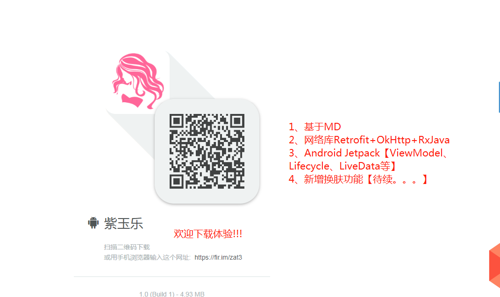
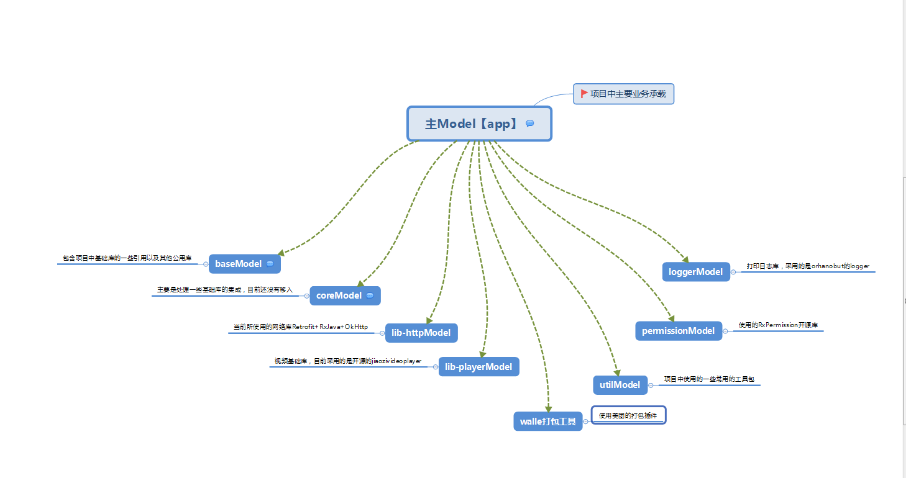
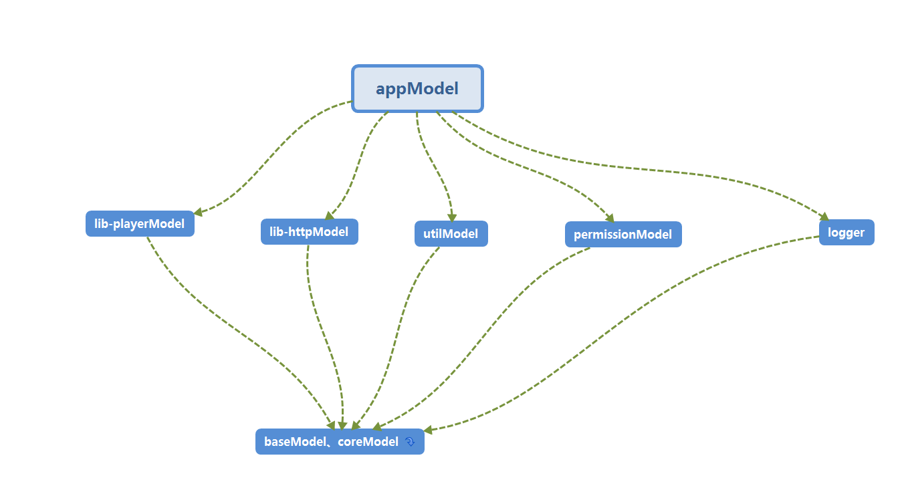

# FanSyShare
第一个项目:

该项目主要涉及的技术:

>1、网络框架使用目前主流 : [Retrofit2 + OkHttp + RxJava2][1]
>2、项目基本架构为 MVP模式以及MVVM                          
>3、[Android Jetpack组件（LiveData、ViewModel、DataBindin等）][2]                                    
>4、图片加载库目前使用的是glide。后期会扩展封装以支持随时切换
>5、动态请求库则是使用的[RxPermissions][3]库                           
>6、目前项目使用的是语言是kotlin+Java,毕竟kotlin是Google的亲儿子嘛                                                  
>7、列表展示则是采用了[BRVAH][4]库、电商类型的列表则是采用了阿里的[vlayout][5]库【不过在试用过程中碰到不少坑】
>8、后面研究了组件化方案DDComponentForAndroid，觉得采用GradlePlugin来控制各个组件之间的联系，不失为一个好的方案，所以在[@luojilab][7]大神的原有基础尝试一下，结果还不错

# 完成部分：
        
>1、网络库的封装【完成】                                         
>2、图片加载库的封装【完成】                                          
>3、项目中依赖的插件库，全部归类统一依赖【完成】     
>4、引入阿里[ARouter][8]路由协议库
                               

# 后期需要完善部分： 
>1、视频播放模块[暂时粗糙完成，采用的是jiaozivideoplayer库]             

#项目结构

  [1]: http://square.github.io/retrofit/
  [2]: https://developer.android.google.cn/jetpack/
  [3]: https://github.com/tbruyelle/RxPermissions/tree/4c4d4e1e84ad1fcf390342c493c8ed09b5e613ca
  [4]: https://github.com/CymChad/BaseRecyclerViewAdapterHelper
  [5]: https://github.com/alibaba/vlayout
  [6]: https://github.com/luojilab/DDComponentForAndroid
  [7]: https://github.com/alibaba/ARouter